```mermaid
gantt
  title f3
  dateFormat  s
  axisFormat |
    wait0 :w0, 0, 0.2s
    logC  :lC, after w0, 0.2s
    logA  :lA, after lC, 0.2s
    errX  :eX, after lA, 0.2s
```

```mermaid
gantt
  title f4
  dateFormat  s
  axisFormat |
    wait2 :w2, 0, 2s
    logA  :lA, after w2, 0.2s
    wait1  :w1, after lA, 1s
    logB  :lB, after w1, 0.2s
    log(100)  :l100, after lB, 0.2s
```

```mermaid
gantt
  title f5
  dateFormat  s
  axisFormat |
    wait2 :w2, 0, 2s
    logA  :lA, after w2, 0.2s
    wait1  :w1, 0, 1s
    logB  :lB, after w1, 0.2s
    log(40)  :l40, after lA, 0.2s
```

```mermaid
gantt
  title f6
  dateFormat  s
  axisFormat |
    wait1 :w1, 0, 1s
    logA  :lA, after w1, 0.2s
    wait1_2  :w1_2, after lA, 1s
    logB  :lB, after w1_2, 0.2s
    wait2  :w2, after lA, 2s
    logC  :lC, after w2, 0.2s
```

```mermaid
gantt
  title f7
  dateFormat  s
  axisFormat |
    wait1 :w1, 0, 1s
    logA  :lA, after w1, 0.2s
    wait2  :w2, 0, 2s
    logB  :lB, after w2, 0.2s
    logC  :lC, after lB, 0.2s
```

```mermaid
gantt
  title f8
  dateFormat  s
  axisFormat |
    wait1 :w1, 0, 1s
    errX  :eX, after w1, 0.2s
    catch  :c, after eX, 0.2s
    logX  :lX, after c, 0.2s
    logA  :lA, after lX, 0.2s
```

```mermaid
gantt
  title f9
  dateFormat  s
  axisFormat |
    wait1 :w1, 0, 1s
    errY  :eY, after w1, 0.2s
```

```mermaid
gantt
  title f11
  dateFormat  s
  axisFormat |
    errX  :eX, 0, 0.2s
    catch :c, after eX, 0.2s
    logX  :lX, after c, 0.2s
```

```mermaid
gantt
  title f12
  dateFormat  s
  axisFormat |
    setTimeout0  :s0, 0, 0.2s
    errX  :eX, after s0, 0.2s
```

## f3()

### 説明

同期処理でtry節のプロミスが返り、finally節のCが出力される。その後、非同期処理のwait0解決後にAが出力され、wait(0).then(logA)解決後にエラーXが実行されるが同期処理ではcatchされずそのまま終了。

### 図解



### 結果

```
C
A
file:///home/nonoyama/js/js-exercises/ch13/ex02/index.js:20
  throw new Error("X");
        ^
Error: X
    at errX (file:///home/nonoyama/js/js-exercises/ch13/ex02/index.js:20:9)
```

## f4()

### 説明

2秒後にAが出力され、2つ目のthenのコールバックが40を入力として実行され、1秒後にBが出力される。その後、ほぼ同時に3つ目のthenのコールバックが100を入力として実行され100が出力される。

### 図解



### 結果

```
A
B
100
```

## f5()

### 説明

2つ目のthenの引数が関数ではなくプロミスになっているため、同期処理として直ちに実行される。その後非同期処理の実行で、1つ目のthen解決後にAが出力し40を返し、2つ目のthenは解決既に満たされているため無視され、3つ目のthenで40を入力にしてコールバックが呼ばれ40が出力される。

### 図解



### 結果

```
B
A
40
```

## f6()

### 説明

1秒後にAが出力されてpが満たされると同時に登録されたコールバックが同時に呼ばれるため、1秒後にB、その1秒後にCが出力される。

### 図解



### 結果

```
A
B
C
```

## f7()

### 説明

同期処理でwait1とwait2はほぼ同時に開始される。wait1().then(logA)が解決した後、pは既に解決満たされているためp.then(logB)は直ちに実行され、その後Ｃが出力される。

### 図解



### 結果

```
A
B
C
```

## f8()

### 説明

1秒後にerrXをthrowし、catch節までプロミスチェーンを下りcatchされる。log("X")出力後にfinally節のAを出力する。

### 図解



### 結果

```
X
A
```

## f9()

### 説明

1つ目のthenのコールバック関数は何も表示せず、次のthenでerrYをthrowする。catch節までプロミスチェーンを下りエラーを出力。最後にfinally節のAを出力する。

### 図解


### 結果

```
Y
A
```

## f10()

### 説明

errYをthrowした後にcatch節がないためエラーで終了する。then(r).then(null, c) と then(r).catch(c)が等しい。

### 図解



### 結果

```
  throw new Error("Y");
        ^

Error: Y
```

## f11()

### 説明

前のプロミスで発生したエラーはプロミスチェーンを下ってcatchされる。

### 図解



### 結果

```
X
```

## f12()

### 説明

errXでエラーで止まる。catchされずにそのまま終了。

### 図解



### 結果

```
    at errX (file:///home/nonoyama/js/js-exercises/ch13/ex02/index.js:20:9)
    at Timeout._onTimeout (file:///home/nonoyama/js/js-exercises/ch13/ex02/index.js:181:22)
    at listOnTimeout (node:internal/timers:608:17)
    at process.processTimers (node:internal/timers:543:7)
```
