```mermaid
gantt
  title h1
  dateFormat  s
  axisFormat |
    wait3 :w3, 0, 3s
    logA  :lA, after w3, 0.2s
    wait2 :w2, after lA, 2s
    logB  :lB, after w2, 0.2s
    wait1 :w1, after lB, 1s
    logC  :lC, after w1, 0.2s
```

```mermaid
gantt
  title h1
  dateFormat  s
  axisFormat |
    errX :eX, 0, 0.2s
    catch  :c, after eX, 0.2s
    logX :lX, after c, 0.2s
```

```mermaid
gantt
  title h1
  dateFormat  s
  axisFormat |
    errX :eX, 0, 0.2s
```

```mermaid
gantt
  title h1
  dateFormat  s
  axisFormat |
    wait2 :w2, 0, 2s
    wait1 :w1, 0, 1s
    errY :eY, after w1, 0.2s
    throw  :t   , after eY , 0.1s
```

## h1()

### 説明

await wait3()はwait3()が完了するのを待つ。そのためwait3(), wait2(), wait1()は同期的に順番に実行される。

### 図解



### 結果

```
A
B
C
```

## h2()

### 説明

errX()の実行は同期関数の中なので、プロミスがrejectで満たされてエラーはcatchされる

### 図解



### 結果

```
X
```

## h3()

### 説明

asyncによりerrX()の実行が非同期になるため、エラーがcatchされない

### 図解



### 結果

```
    throw new Error("X");
          ^

Error: X
```

## h4()

### 説明

await p1で非同期にp1の解決を待っている間に、p2が非同期でエラーをスローするためcatchできずにエラーとなる。

### 図解



### 結果

```
    throw new Error("Y");
          ^

Error: Y
```
