```mermaid
gantt
  title i1
  dateFormat  s
  axisFormat |
    wait1 :w1, 0, 1s
    v=40  :v40, after w1, 0.2s
    wait2 :w2, 0, 2s
    v=100  :v100, after w2, 0.2s
    log40  :l40, after v40, 0.2s
    wait2_2 :w2_2, after l40, 2s
    log100  :l100, after w2_2, 0.2s
```

```mermaid
gantt
  title i2
  dateFormat  s
  axisFormat |
    wait3 :w3, 0, 1s
    logA  :lA, after w3, 0.2s
    wait2 :w2, 0, 2s
    logB  :lB, after w2, 0.2s
    wait1 :w1, 0, 3s
    logC  :lC, after w1, 0.2s
    logV  :lV, after lC, 0.2s
```

```mermaid
gantt
  title i3
  dateFormat  s
  axisFormat |
    v=42   :v42, 0, 0.2s
    wait3 :w3, 0, 3s
    v=0   :v0, after w3, 0.2s
    errX  :eX, after v0, 0.2s
    ignored  :ig, after eX, 0.2s
    wait2 :w2, 0, 2s
    logB  :lB, after w2, 0.2s
    wait1 :w1, 0, 1s
    errY  :eY, after w1, 0.2s
    catch :c, after eY, 0.2s
    logY  :lY, after c, 0.2s
    logV  :lV, after lY, 0.2s
    wait3_2 :w3_2, after lV, 3s
    logV  :lV_2, after w3_2, 0.2s
```

```mermaid
gantt
  title i3
  dateFormat  s
  axisFormat |
    wait1 :w1, 0, 1s
    p1_wait2_1 :p1w1, after w1, 2s
    p1_wait2_2 :p1w2, after p1w1, 2s
    p1_wait2_3 :p1w3, after p1w2, 2s
    p1_wait2_4 :p1w4, after p1w3, 2s
    p1_wait2_5 :p1w5, after p1w4, 2s
    v += 5 :p1_v,after p1w5, 0.2s 

    p2_wait2_1 :p2w1, 0, 2s
    p2_wait2_2 :p2w2, after p2w1, 2s
    p2_wait2_3 :p2w3, after p2w2, 2s
    p2_wait2_4 :p2w4, after p2w3, 2s
    p2_wait2_5 :p2w5, after p2w4, 2s
    v += 5 :p2_v, after p2w5, 0.2s 

    v = 10 :v10, after p1_v, 0.2s 
```

## i1()

### 説明

Promise.any()の引数配列の２つの非同期処理は、先に終わるwait1の値42で満たされる。その後、もう１つの非同期処理が継続されるため、v=100によりPromiseが満たされた返り値が上書きされる。ただし、プロミス自体は既に満たされているので返り値0は無視される。

### 図解



### 結果
```
42
100
```


## i2()

### 説明

全てのプロミスが返った後に結果の配列を返しvに代入。vを出力。

### 図解


### 結果
```
C
B
A
[ 'A', 'B', 'C' ]
```


## i3()

### 説明

wait1が満たされてerrYにてcatch節が呼ばれる。catch節中のwait3()中に、Promise.all()内のwait3()が終了しv=0に書き換わるがerrXは無視される。その後、catch節のwait3が満たされてlog(0)を出力する。

### 図解


### 結果
```
Y
42
B
0
```

## i4()

### 説明
- 元のコード
p1とp2の非同期プロセスは１秒毎に交互にvの値を更新しようとするが、nextをvに代入する前にawait wait2()が入るため、直前にもう一方の非同期プロセスがvに加える分はカウントされない。従って10ではなく半分の5が最後に出力される。

- 変更後のコード
p1 と p2 のそれぞれの関数実行が全て完了してからvに結果を加える。

### 図解



### 結果
```
10
```
