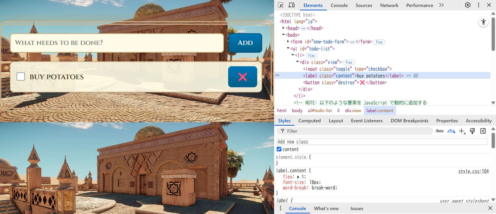
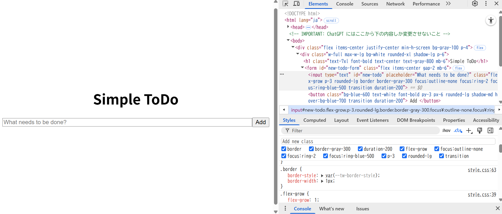
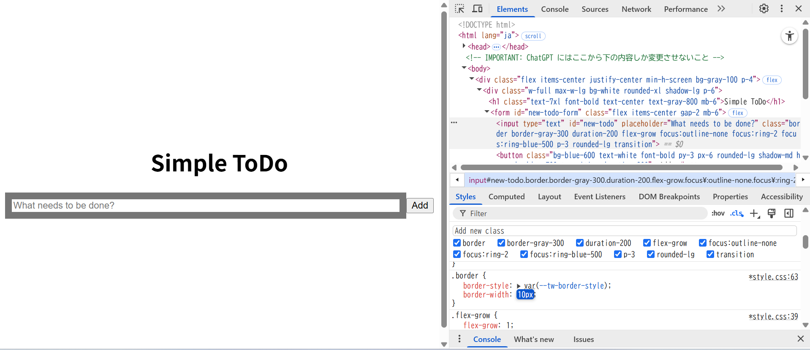

## ブラウザの開発者ツールを使うと CSS のデバッグを効率的に行うことができる。CSS のデバッグ を参考にして以下を実施しなさい
[CSSのデバッグ](https://developer.mozilla.org/ja/docs/Learn/CSS/Building_blocks/Debugging_CSS)

1. 15.4-10.1 および 15.4-10.2 の ToDo アプリに対してブラウザの開発者ツールから値の変更やプロパティの追加を試してみなさい
    * ex01のcontentクラスにmarginを足す
        * before
            
        * after
    
    * ex02のborderクラスのborder-widthを変更
        * before
            
        * after
            

2. 開発者ツールで CSS に関して実行できる操作を検索エンジンで調べ、便利だと思ったものを 3 つ挙げなさい
    * 無効なスタイルを確認できる（取り消し線になっている）
    * `:hob`ボタンを押してhoverにチェックを入れると`:hover`時のスタイルを確認できる
    * rotate、shadow、flexなどは直感的なUIで数値やレイアウトをリアルタイムで調整して結果を確認できる

    https://ics.media/entry/230317/

3. 15.4-10.2 のアプリの body 要素に対し、元々 HTML および JS 内で利用していなかった Tailwind CSS のクラス (bg-rose-600 など何でも良い) を開発者ツールから追加すると変更が反映されないが、これは何故か調べなさい
    * ビルド時に必要なクラスだけをCSSに抽出しているため、HTMLの変更をCSSに反映する操作がないと直ちには反映されない。