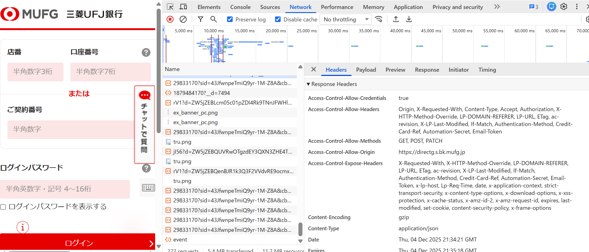
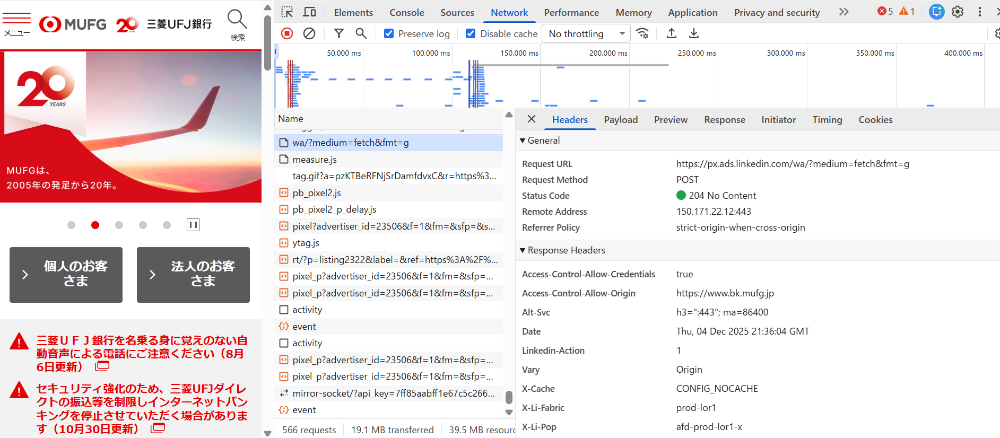
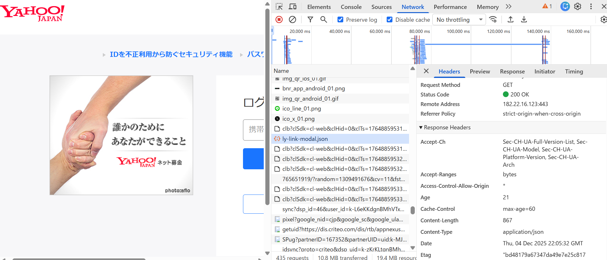

## 問題
* 実際のサービスの通信をデベロッパーツールなどで眺めて CORS の設定を確認しなさい

## 解答
* 三菱UFJ銀行のログインページ
  * 設定されている
  
* 三菱UFJ銀行のトップページ
  * "access-control-allow-credentials" と "access-control-allow-origin" だけが設定されている
  * この場合、単純リクエスト（Preflightが発生しないもの）は許可される
  
* Yahooショッピングのログインページ
  * 特になし
  