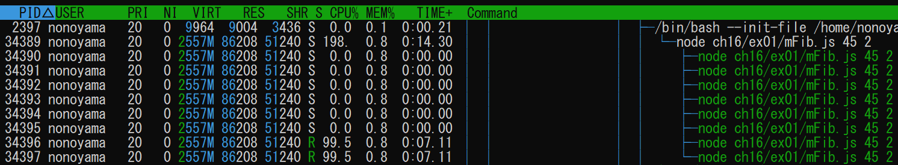
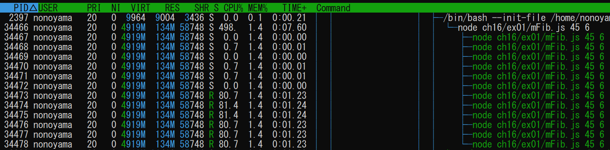
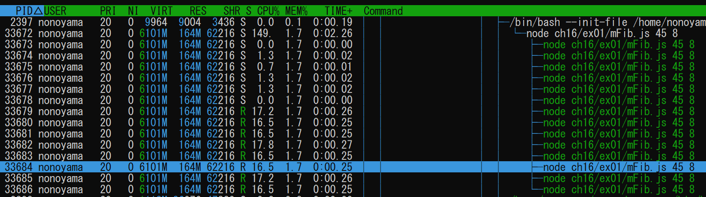
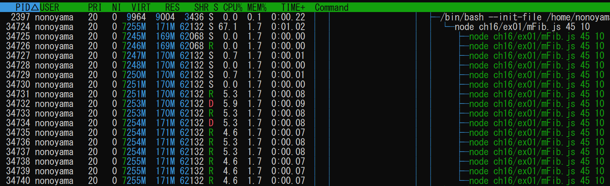
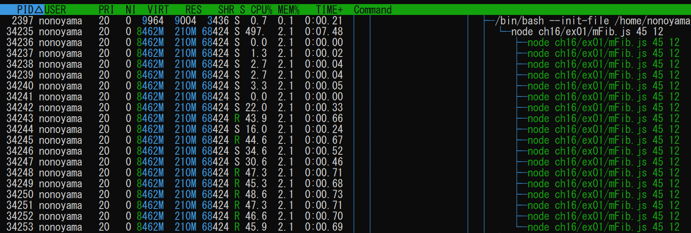

## 問題
用語「マルチスレッド」について調べなさい。
次にフィボナッチ数を計算するmFib.jsをスレッド数を変更しながら実行し(*1)、
コンソール出力とOS機能(*2)で結果とスレッド数を確認しなさい。
最後にあなたのPCのCPUスペックを調査し、適切なスレッド数についての考察を記しなさい。
*1 mFib.jsは第一引数で項数、第二引数でスレッド数を指定。コンソールには実行時間とフィボナッチ数が出力される。講師PCでは node mFib.js 45 4 の実行に15秒程かかる。
*2 OSがwindowsの場合"リソースモニター"（"Winキー+r"の後"resmon"で起動）で実行中プログラムのスレッド数を確認できる。

## 解答
* マルチスレッドは「一つのコンピュータープログラムを実行する際に、アプリケーションのプロセス（タスク）を複数のスレッドに分けて並行処理する流れのこと」
  * 補足： 一般的なマルチスレッドはメモリを共有して、共有リソースへの排他制御などで並列処理を実現する。JavaScriptのWeb Workerはリソース共有はせず、完全に独立な環境が用意され、終了時のメッセージングをイベントリスナーで受け取ることで並列処理を実現している。
  * 参考リンク
    * https://business.ntt-west.co.jp/glossary/words-00262.html
* スレッド数確認
  * WSLだとリソースモニタ上でスレッド数がわからなかったためhtopで確認
    * スレッド数２指定　⇒　Total execution time: 18.073s
    
    * スレッド数４指定　⇒　Total execution time: 14.558s
    
    * スレッド数６指定　⇒　Total execution time: 13.189s
    
    * スレッド数８指定　⇒　Total execution time: 12.538s
    
    * スレッド数10指定　⇒　Total execution time: 12.310s
    
    * スレッド数12指定　⇒　Total execution time: 12.643s
    
  * コア数10で、これ以上のスレッドが同時に実行されることは確認できなかったため、CPUのコア数前後が最適なスレッド数となる
    