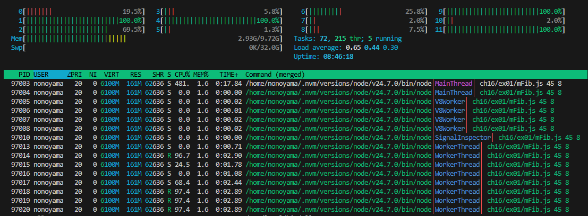
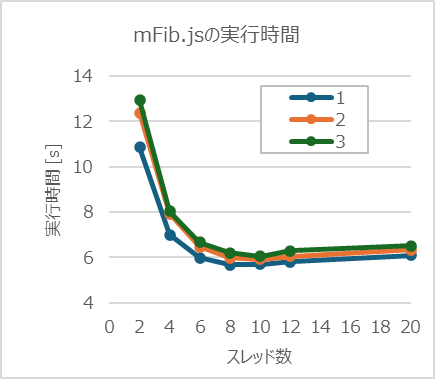

## 問題

用語「マルチスレッド」について調べなさい。
次にフィボナッチ数を計算するmFib.jsをスレッド数を変更しながら実行し(*1)、
コンソール出力とOS機能(*2)で結果とスレッド数を確認しなさい。
最後にあなたのPCのCPUスペックを調査し、適切なスレッド数についての考察を記しなさい。
*1 mFib.jsは第一引数で項数、第二引数でスレッド数を指定。コンソールには実行時間とフィボナッチ数が出力される。講師PCでは node mFib.js 45 4 の実行に15秒程かかる。
*2 OSがwindowsの場合"リソースモニター"（"Winキー+r"の後"resmon"で起動）で実行中プログラムのスレッド数を確認できる。

## 解答

- マルチスレッドは、1つのプログラムの中で複数の処理の流れ（スレッド）を持ち、CPUがそれらを並行して実行する仕組みである
- フィボナッチ数を計算するmFib.jsをスレッド数を変更しながら実行
  - スレッド数８指定実行時のhtop画面キャプチャ（WSLだとリソースモニタ上でスレッド数がわからなかったためhtopで確認）
    
  - スレッド数10辺りで底打ち
    
- 適切なスレッド数についての考察
  - CPU構成としては、WSLで認識されているコア数は12個、Windowsでは物理CPU10個/論理CPU12個となっており、その付近で高速化は止まっている（物理CPUの個数が最も効率よくなっているように見えるがばらつきの範囲にも見えるため今回の実験だけだとわからない）
    ```
    $ lscpu
    Architecture:             x86_64
      CPU op-mode(s):         32-bit, 64-bit
      Address sizes:          46 bits physical, 48 bits virtual
      Byte Order:             Little Endian
    CPU(s):                   12
      On-line CPU(s) list:    0-11
    Vendor ID:                GenuineIntel
      Model name:             13th Gen Intel(R) Core(TM) i7-1365U
        CPU family:           6
        Model:                186
        Thread(s) per core:   2
        Core(s) per socket:   6
        Socket(s):            1
        Stepping:             3
    ```
