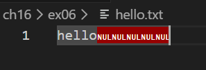
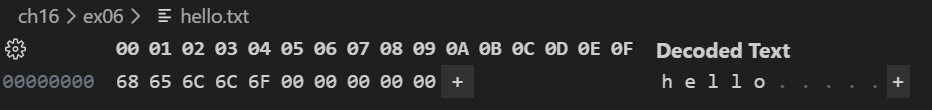

## 問題
P.664 では fs.truncate() を利用してファイルを拡張した場合には拡張された部分には 0 が書き込まれる、と説明されていますが、これは ASCII の"0"が書き込まれるという意味ではありません。
実際に fs.truncate() を利用してファイルを拡張し、拡張されたファイルの内容をバイナリエディタ(Stirling や VSCode の HexEditor 拡張機能等)で確認しなさい。

## 解答
- 
- 
  - `0x00` で埋められる（ヌル文字）。ASCIIの0は`0x30`のため異なる。