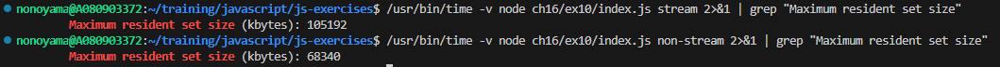
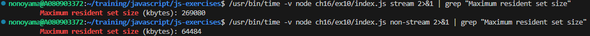

* fs.readFile()でもメモリ使用量は大きくなっていない、、？
  * 20 MB 程度のファイルの場合
    * ストリーム： 105 MB
    * 非ストリーム： 68 MB
    

  * 180 MB 程度のファイルの場合
    * ストリーム： 268 MB
    * 非ストリーム： 64 MB
    


* ファイルサイズ
```
$ ls -lh ch16/ex10/file.txt 
-rw-r--r-- 1 nonoyama nonoyama 120M Jan  7 07:51 ch16/ex10/file.txt
```
* 結果
```
nonoyama@A080903372:~/training/javascript/js-exercises$ node ch16/ex10/server.js
Listening on port 8000
Stream Copy start { rss: '59 MB', heapUsed: '7 MB', external: '3 MB' }
Stream Copy finish { rss: '87 MB', heapUsed: '9 MB', external: '24 MB' }
=================================
nonoyama@A080903372:~/training/javascript/js-exercises$ node ch16/ex10/server.js
Listening on port 8000
non-Stream Copy start { rss: '61 MB', heapUsed: '7 MB', external: '3 MB' }
non-Stream finish { rss: '61 MB', heapUsed: '7 MB', external: '3 MB' }
```