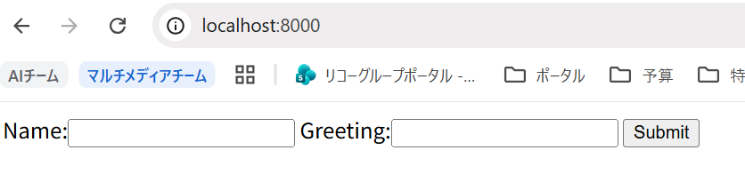
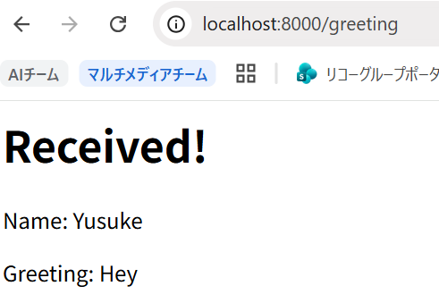

## 実装

- `/`にGETリクエスト
  
- 名前を入れてSubmit（`/greeting`にPOSTリクエスト）
  

## 問題

複数のTCPクライアント (net.Socket) でHTTPリクエストを送信せず同時に接続を維持した際、何接続で接続が確立できなくなるか確認し、確立できなかった理由を書きなさい。

## 解答

- 2万5千接続前後で新規接続を受け付けなくなる（以下のエラー）。エラー発生時の接続数は固定値でなく変動する。これはローカルポートが枯渇して新たなTCP接続を確立できないため発生する。OSの有効なポート数は16384。

```error
node:events:486
      throw er; // Unhandled 'error' event
      ^

Error: connect EADDRNOTAVAIL 127.0.0.1:8000 - Local (0.0.0.0:0)
    at internalConnect (node:net:1110:16)
    at defaultTriggerAsyncIdScope (node:internal/async_hooks:472:18)
    at GetAddrInfoReqWrap.emitLookup [as callback] (node:net:1523:9)
    at GetAddrInfoReqWrap.onlookupall [as oncomplete] (node:dns:134:8)
Emitted 'error' event on Socket instance at:
    at emitErrorNT (node:internal/streams/destroy:170:8)
    at emitErrorCloseNT (node:internal/streams/destroy:129:3)
    at process.processTicksAndRejections (node:internal/process/task_queues:90:21) {
  errno: -99,
  code: 'EADDRNOTAVAIL',
  syscall: 'connect',
  address: '127.0.0.1',
  port: 8000
}

Node.js v24.7.0
```

```
PS C:\Users\r00481995> netsh int ipv4 show dynamicport tcp

プロトコル tcp の動的ポートの範囲
---------------------------------
開始ポート      : 49152
ポート数        : 16384
```

- エラー発生タイミングまでのCPUとメモリの利用率は特に枯渇するレベルではなかったから関係なさそう

- 疑問：
  - ポート数よりも多く接続できているのはなぜか
  - エラー発生後すぐに連続コネクションのスクリプトを再実行すると、再びコネクションができる状態になる。ソケットを閉じても閉じなくても。なぜ
