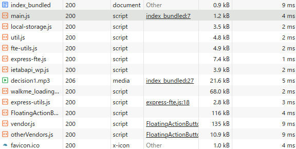
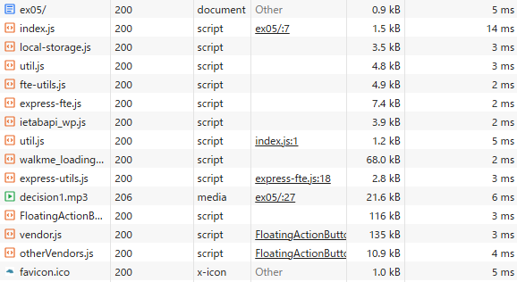

## 問題

バンドルしたコードと元のコードを比較し、どのような処理が行われたかを確認しなさい。
バンドル前後それぞれのコードを利用するページをローカルサーバで配信してブラウザから閲覧できるようにしなさい。
開発者ツールで ネットワーク タブを開き、スクリプトのダウンロード時間、ページの読み込み完了時間について比較しなさい

## 解答

- 行われた処理
  - ファイルを分割して定義した関数が１つのファイルの中に記述されている
  - コード内で定義された関数名や変数名が１文字のアルファベットに変換されている
  - 全てのコードが即時実行関数の中で実行されるようになっている

- スクリプトのダウンロード時間
  - バンドルした方がはやい
    - main.js: 4ms
    - index.js: 14ms、util.js: 5ms
  - 記録画像
    
    
- ページの読み込み完了時間（１回目、２回目）
  - 繰り返しのばらつきが大きくて有意差がわからない
    - バンドル： 150ms, 180ms
    - 非バンドル： 190ms, 190ms

- 実行コマンド
  - `npx webpack --mode=production ./ch17/ex05/index.js -o ./ch17/ex05/dist`
  -
