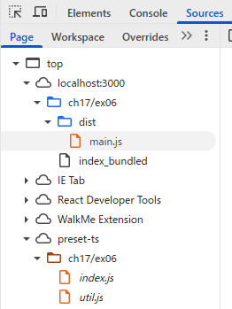
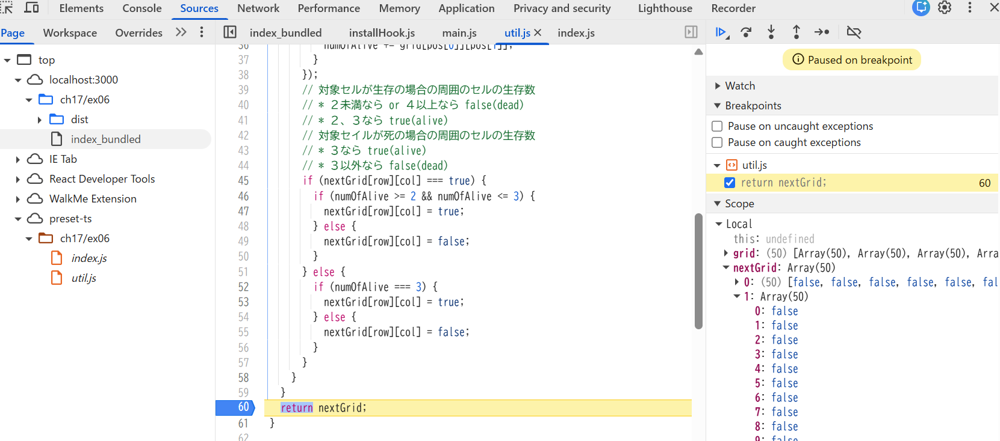

- ソースマップも出力するコマンド
  - `npx webpack --mode=production --devtool=source-map ./ch17/ex06/index.js -o ./ch17/ex06/dist`
- ソースコードファイルがどのように表示されるかを確認しなさい。
  
- バンドルしたコードの実行中に、バンドル前のソースコードファイルに基づいたブレークポイントの設定や変数の値の確認等のデバッグが可能か確認しなさい。
  
