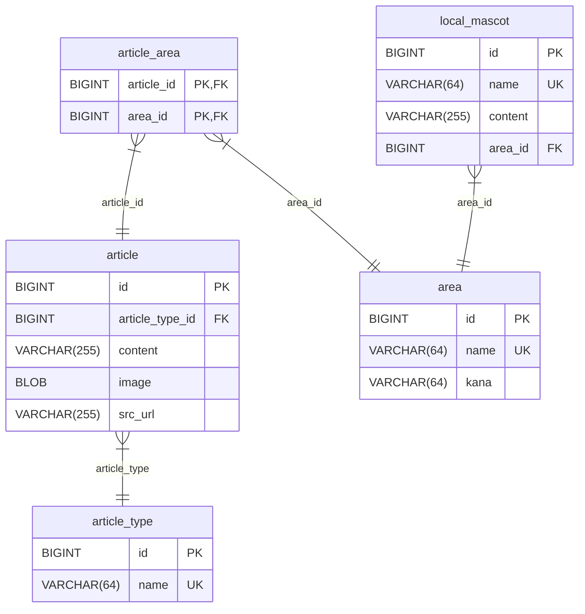

### データスキーマ

```mermaid
erDiagram

article {
    BIGINT id PK
    BIGINT article_type_id FK
    VARCHAR(255) content
    BLOB image
    VARCHAR(255) src_url
}

article_type {
    BIGINT id PK
    VARCHAR(64) name UK
}
article |{--|| article_type: article_type

article_area {
    BIGINT article_id PK, FK
    BIGINT area_id PK, FK
}
article_area |{--|| article: article_id
article_area |{--|| area: area_id


area {
    BIGINT id PK
    VARCHAR(64) name UK
    VARCHAR(64) kana
}


local_mascot {
    BIGINT id PK
    VARCHAR(64) name UK
    VARCHAR(255) content
    BIGINT area_id FK
}
local_mascot |{--|| area: area_id

```
